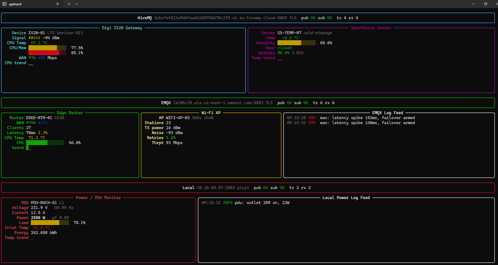
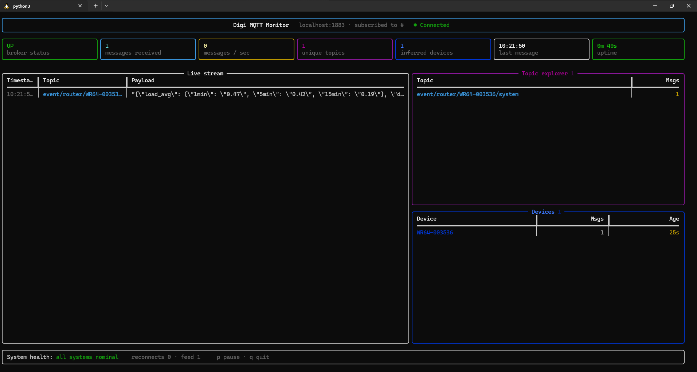

# MQTT Terminal Dashboards



Live terminal dashboards (built with [Rich](https://github.com/Textualize/rich)) that publish simulated device metrics to MQTT brokers over TLS and render them back in real time as they round-trip through the broker. Each script spins up its own publisher and subscriber threads, so what you see on screen is what actually arrived over MQTT — not just what was generated in memory.

Three variants are included, covering one, two, or three brokers at once:

| Script | Brokers | Panels |
|---|---|---|
| `mqtt-dashboard.py` | 1 (HiveMQ Cloud) | Simulated server metrics |
| `combo.py` | 2 (HiveMQ Cloud, EMQX Cloud) | Digi IX20 gateway, SmartSense sensor, edge router, Wi-Fi AP, live log feed |
| `tri.py` | 3 (HiveMQ Cloud, EMQX Cloud, local Mosquitto) | All of the above plus a Power/PDU monitor and local log feed |
| `dashboard_terminal.py` | 1 (any broker) | Generic monitor — subscribes to `#`, infers devices from topic prefixes, live message stream, topic explorer, msgs/sec |



## Requirements

```bash
pip install paho-mqtt rich --break-system-packages
```

For the EMQX Cloud panels, place `emqxsl-ca.crt` next to the script (already included in this repo). If missing, the script falls back to the system CA store.

## Usage

```bash
python3 mqtt-dashboard.py
python3 mqtt-dashboard.py --host OTHER_HOST --user U --password P --interval 4

python3 combo.py
python3 combo.py --interval 4 --emqx-ca ./emqxsl-ca.crt

python3 tri.py
python3 tri.py --interval 4 --emqx-ca ./emqxsl-ca.crt --local-host 10.10.65.67

python3 dashboard_terminal.py                     # monitor real traffic on localhost
python3 dashboard_terminal.py --host 10.10.65.67   # different broker
python3 dashboard_terminal.py --demo               # self-generate WR-series traffic
python3 dashboard_terminal.py -u user -P pass --tls
```

`dashboard_terminal.py` doesn't assume fixed device models — it subscribes to `#` and infers devices/topics from whatever traffic it sees. Controls (TTY only): `p` pause/resume feed, `q` quit.

`tri.py` additionally expects a local Mosquitto broker (plain, port 1883) reachable at `--local-host` for the Power/PDU panel.

## Notes

- Broker host/user/password defaults are hardcoded in the scripts for demo purposes — swap them out (or pass CLI flags) before pointing this at anything real. Rotate the credentials currently in these files if this repo is public.
- All metrics shown are randomly generated ("random walk") to simulate device behavior; nothing here reads from real hardware.
